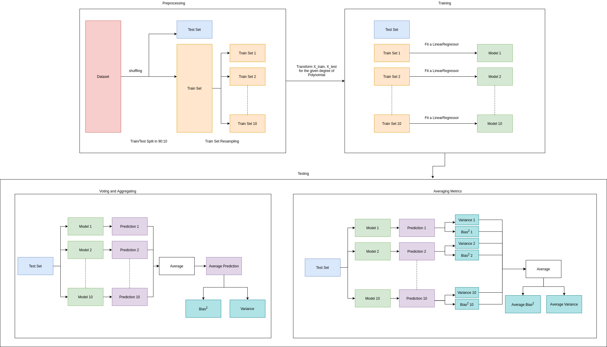
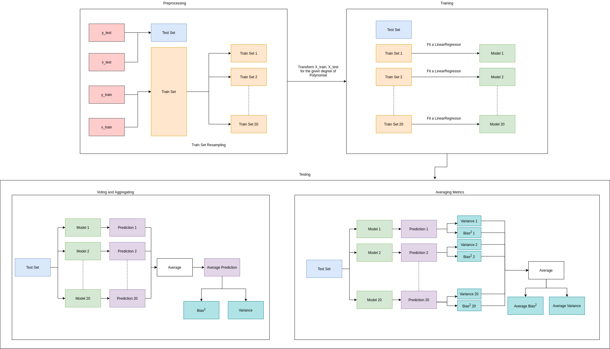

# Exploring Bias, Variance for a Linear Classifier

## Getting Started
`cd` into the repository and install dependencies mentioned in [`requirements.txt`](requirements.txt) in a virtual environment (preferably):
```
virtualenv .env
source .env/bin/activate
pip3 install -r requirements.txt
```
to run the scripts, cd into the [`scripts`](scripts/) folder and run `$ python3 <script name>`

## Definitions
### Bias
Bias is inherent error that you obtain from your classifier. Bias is taken as the difference between the expected (or average) prediction of our model and the correct value which we are trying to predict.

$$ Bias^2 = (E[\hat{f}(x)]-f(x))^2 $$

### Variance
Variance captures how much your classifier changes if you train on a different training set. 
Variance is how much the predictions for a given point vary between different realizations of the model.

$$ Variance = E[(\hat{f}(x) - E[\hat{f}(x)])^2] $$

### Bias-Variance Tradeoff
If we denote the variable we are trying to predict as $Y$ and our covariates as $X$, we may assume that there is a relationship relating one to the other such as $Y=f(X)+ϵ$ where the error term $ϵ$ is normally distributed with a mean of zero like so $ϵ∼N(0,σ_ϵ)$.
We model $\hat{f}(x)$ of $\hat{f}(x)$, and the expected prediction error is:

$$ Error(x) = E[(Y-\hat{f}(x))^2] $$ 
The error can be simplified into form with $Bias$ and $Variance$ terms.

$$ Error(x) = Bias^2 + Variance + Irreducible Error $$


## Implementation
### Question 1
>

#### Preprocessing
We read the pickle using `pickle.load` and split the dataset obtained into train and test sets using `sklearn.model_selection.train_test_split` in a 90:10 ratio. Using `np.split`, we split the train set
into 10 training sets.

For a given degree `n`, we convert the unidimensional `X_train`, and `X_test` sets into an `n` degree feature set using `sklearn.preprocessing.PolynomialFeatures(n).fit_transform`.
#### Training
We fit a linear regression model on every train set suing `sklearn.linear_model.LinearRegression().fit`. We get the predicted sets on the `X_test` set using `sklearn.linear_model.LinearRegression().fit().predict` henceforth reffered by `f'i` where i is between 1 and 10.

#### Testing
For testing and calculating metrics we follow two approaches:
##### 1. Voting and Aggregating
Here we consider the bag of 10 models `f'1(x), f'2(x)..., f'10(x)` as our aggregated model `f'(x)` where `f'(x) = mean(f'1(x) + f'2(x) + ... + f'10(x))`. For calculating metrics, we do the following:
- `np.var(f')` for variance
- `np.mean((np.mean(f')-f')**2)` for bias square
  
##### 2. Averaging Metrics
Here we consider every model individually and calculate the metrics for each, using:
- `var_i = np.var(f'i)`
- `bias_square_i = np.mean((np.mean(f'i)-f'i)**2)` 

Finally, we average all the `var_i` and `bias_square_i` values to get the variance and the bias square respectively.

### Question 2


#### Preprocessing
We read the pickles using `pickle.load` where the train set is split into 20 train subsets.

#### Training
***We follow the same routine here as in Question 1 but for 20 train sets.***

#### Testing
***We follow the same routine here as in Question 1 but for 20 train sets.***

## Tables
### Table 1_1
|   degree |   bias square |   variance |
|---------:|--------------:|-----------:|
|        1 |       66.1979 |  0.0214866 |
|        2 |       66.2179 |  0.0308447 |
|        3 |       66.2193 |  0.0301848 |
|        4 |       66.2178 |  0.0323795 |
|        5 |       66.2166 |  0.0326087 |
|        6 |       66.2143 |  0.032256  |
|        7 |       66.216  |  0.0322882 |
|        8 |       66.2156 |  0.0323511 |
|        9 |       66.2157 |  0.0323543 |

### Table 1_2
|   degree |   bias square |   variance |
|---------:|--------------:|-----------:|
|        1 |       85.0369 |    50.0878 |
|        2 |       84.6621 |    78.6616 |
|        3 |       84.6644 |    80.9047 |
|        4 |       84.6616 |    82.6363 |
|        5 |       84.6601 |    82.6839 |
|        6 |       84.6577 |    83.1929 |
|        7 |       84.6573 |    83.3788 |
|        8 |       84.6578 |    83.2218 |
|        9 |       84.6578 |    83.06   |

### Table 2_1
|   degree |   bias square |   variance |
|---------:|--------------:|-----------:|
|        1 |   6.77191e+06 |    11992.7 |
|        2 |   6.77189e+06 |    12196.1 |
|        3 |   6.76235e+06 |    17445.6 |
|        4 |   6.76242e+06 |    17459.5 |
|        5 |   6.76251e+06 |    17384.2 |
|        6 |   6.76238e+06 |    17469.1 |
|        7 |   6.76255e+06 |    17293.8 |
|        8 |   6.76256e+06 |    17277.9 |
|        9 |   6.76257e+06 |    17281.6 |

### Table 2_2
|   degree |   bias square |    variance |
|---------:|--------------:|------------:|
|        1 |   6.69348e+06 | 4.83755e+06 |
|        2 |   6.69284e+06 | 4.97458e+06 |
|        3 |   6.64213e+06 | 7.09749e+06 |
|        4 |   6.64305e+06 | 7.16422e+06 |
|        5 |   6.6458e+06  | 7.19548e+06 |
|        6 |   6.64728e+06 | 7.26849e+06 |
|        7 |   6.64703e+06 | 7.23919e+06 |
|        8 |   6.65328e+06 | 7.27335e+06 |
|        9 |   6.65311e+06 | 7.32985e+06 |